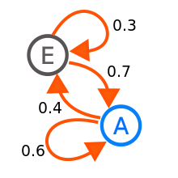

```{r setup, include=FALSE}
knitr::opts_chunk$set(echo = TRUE)
```
 

马尔科夫矩阵用于描述状态空间中，状态随机转移的过程。下一个状态只与当前状态有关，与其他状态无关。如下示例，

<div align='center'>
  
</div>

## 马尔科夫矩阵性质

**马尔科夫矩阵定义**


* $a_{ij} \ge 0$
* $\sum_{j=1}^{n}{a_{*j}} = 1$，（也可以是行，关键看A左乘还是右乘）

**例1**
$$
  A = \begin{bmatrix}
    0.4 & 0.7  \\
    0.6 & 0.3 \\
  \end{bmatrix}
$$


**性质1** $\lambda = 1$是特征值（可以先用上面的A试试）

证明：

设向量$1_n=\begin{bmatrix} 1 \\ \vdots \\ 1 \end{bmatrix}$

$$
  1_n^TA = 1_n^T \Rightarrow A^T1_n=1_n
$$

根据定义，上面必然成立！所以1是$A^T$特征值，根据特征值定义$A$与$A^T$特征值相同，所以1必然是$A$特征值。


证毕！


**性质2** 特征值$|\lambda| \le 1$ 

证明：

证明之前，先证明马科夫矩阵一个性质：如果$A$是马科夫矩阵，那么$A^n$仍然是马尔科夫矩阵。设一个函数——向量求和：$s(x) = \sum_{i=1}^nx_i$。在$A^2$的过程中，对于任意$[A^2]_l$列向量，计算向量和，

$$
  s([A^2]_l) = s(\sum_{i=1}^n a_ia_{li}) = \sum_{i=1}^n s(a_i)a_{li}
             = \sum_{i=1}^n a_{li}  = 1 
$$

$[A^2]_{ij} \ge 0$，因为每个元素都是由大于0的元素相乘并相加得到，不可能得到负数。所以$A^2$是马尔科夫矩阵。同理，$A^3=A^2A$也是马尔科夫矩阵，最后可以归纳到任意$A^n$也是马尔科夫矩阵矩阵。


根据特征值的幂和特征向量$x$,可得$u=A^nx=\lambda^nx$，假设存在$|\lambda| > 1$，那么$u \rightarrow \infty$。但是$A^n$是马尔科夫矩阵矩阵，所以$A_{ij}\le 1$，所以$A^nx$不可能无限大，与已知矛盾，所以假设不成立。

证毕！


**性质3** $A^nu_0$收敛

假设马科夫矩阵$A$有n个特征向量，且只有一个特征值为1的特征值$v_1$（绝大数实际情况的马尔科夫矩阵这这样）,根据之前课程中的内容，将其展开，

$$
  u_n= A^nx_0 = c_1 1^n x_1 + c_2 \lambda_2^n x_2 + \cdots + c_n \lambda_n^n x_n
     \approx c_1x_1
$$

因为其他特征值据对值小于1，所以最后就收敛为$c_1x_1$。

 


**例2** 人口迁移例子，两个城市人口迁移

$$
  A=\begin{bmatrix} 0.9 & 0.2 \\ 0.1 & 0.8 \end{bmatrix}, u_0=\begin{bmatrix} 0 \\ 1000 \end{bmatrix}
$$

```{r markov_sample,cache=T}
A <- matrix(c(.9,.2,.1,.8),byrow=T,nrow=2)
u0 <- matrix(c(0,1000))

A_eig <- eigen(A)
print(A_eig)

solve(A_eig$vectors, u0)[1,1]*A_eig$vectors[,1] # 收敛后的向量

# 迭代验证
n <- 50
u <- u0
for(i in 1:n) {
  u <- A %*% u
  if(i <= 3 || i >=n-3){
    print(sprintf("i=%d",i))
    print(u)
  }
}

```

 
## 马尔科夫矩阵参数估计

主要思路是使用马尔科夫转换的假设，构建目标函数，然后使用解答释然，求解极值，估计矩阵参数。由于该释然函数带有约束，使用拉格朗日乘子式将其变成无约束极值问题，最后得到估计值。

### 单对象目标函数
首先，定义一些符号，

* $X^n$表示随机序列，长度为n。$x^n \equiv x_1,x_2,\cdots, x_n$表示该随机序列样本。
* $X_n$表示随机状态，$x_n$表示样本。（注意：n在X右上与右下的意义是不同的。）
* $p_{ij}=Pr(X_n=j\\|X_{n-1}=i)$表示状态从i到j的概率。
* $n_{ij}$表示状态从i到j的样本个数。
* k为状态的数量

那么出现样本$x^n\equiv x_1,x_2,\cdots, x_n$的概率如下

$$
\begin{align}
	Pr(X^n=x^n) &= Pr(X_1 = x_1)Pr(X_2=x_2|X^1 = x^1)\cdots Pr(X_n=x_n|X^{n-1}=x^{n-1}) \\
				&= Pr(X_1 = x_1) \prod_{t=2}^n{Pr(X_t=x_t|X^{t-1}=x^{t-1})} \\
				&= Pr(X_1 = x_1) \prod_{t=2}^n{Pr(X_t=x_t|X_{t-1}=x_{t-1})} \\
\end{align}
$$

上面的等式中，第一，二行直接使用条件概率，计算样本概率，第三行利用了马尔科夫链的性质，即第t个状态只与t-1的状有关，与之前的状态无关。由于各个状态转换是固定的，变的是不同转换的次数，所以上面的等式可以换一种方式表示，如下：

$$
	Pr(X^n=x^n) = Pr(X_1 = x_1)\prod_{i=1}^k\prod_{j=1}^k{p_{ij}^{n_{ij}}}
$$

### 多对象目标函数
现在概率公式已经化简的比较简单了，但是还有一个问题：现在只观察了一个对象的转换序列，如果多个对象呢？接下来，将上面的公式对m个对象进行扩展，先定义一些补充变量，

* 总共有$m$个对象。
* $X(l)^n$是第$l$个对象的随机序列。
* $X(l)_n$是第$l$个对象的第n个状态的随机变量。
* $n(l)$表示第$l$个对象的状态转换次数。
* $n(l)_{ij}$表示第$l$个对象状态从i到j的样本个数。
* $N_{ij} = \sum_{l=1}^m{n(l)_{ij}}$，表示所有样本中状态i到j的样本数。

并且，**假设m个对象相互独立**，目标函数设为$L(p)$，扩展后的样本概率为

$$
\begin{align}
	L(p)&= \prod_{l=1}^m{Pr(X(l)^{n(l)} = x(l)^{n(l)})} \\
		&= \prod_{l=1}^m{\left( Pr(X(l)_1 = x(l)_1) \prod_{i=1}^k\prod_{j=1}^k{p_{ij}^{n(l)_{ij}}} \right)} \\
		&= \left(\prod_{l=1}^m{Pr(X(l)_1 = x(l)_1)}\right) 
		   \left(\prod_{l=1}^m{ \prod_{i=1}^k\prod_{j=1}^k{p_{ij}^{n(l)_{ij}}}}\right) \\					 
		&= \left(\prod_{l=1}^m{Pr(X(l)_1 = x(l)_1)}\right)  
		   \left(\prod_{i=1}^k\prod_{j=1}^k{p_{ij}^{\sum_{l=1}^m{n(l)_{ij}}}} \right) \\
		&= \left(\prod_{l=1}^m{Pr(X(l)_1 = x(l)_1)}\right) 
		   \left(\prod_{i=1}^k\prod_{j=1}^k{p_{ij}^{N_{ij}}} \right) \\
\end{align}
$$

### 带约束的优化
现在的工作就是找到L(p)最大时对应的转换矩阵p，L(P)的最大值并不关注。由于连乘不太方便计算，所以对$L(p)$取自然对数，由于$\ln$是单调递增，所以当$\ln{L(p)}$最大时，p与L(p)最大时的p一致。所以，现在转换成了一个优化问题，如下：

$$
\begin{align}
	\max_{p} {\ln{L(p)}} 
		&= \max_{p} {
				\ln{
					\left( 
						\prod_{l=1}^m{Pr(X(l)_1 = x(l)_1)}\right) 
						\left(\prod_{i=1}^k\prod_{j=1}^k{p_{ij}^{N_{ij}}} 
					\right)
				}
			} \\
		&= \max_{p} {
			\left( 
				\sum_{l=1}^m \ln{\left( Pr(X(l)_1 = x(l)_1) \right)} 
				+ \sum_{i=1}^k\sum_{j=1}^k{N_{ij}\ln(p_{ij})} 
			\right)} \\
\end{align}	
$$

上面的目标函数比较简单，但是不要忘记，有约束条件：

$$
	\sum_{j=1}^k{p_{ij}} = 1, i \in (1,\cdots,k), 且 p_{ij} \ge 0
$$

带有约束的最优化是无法直接求导计算的，因为计算结果可能不遵守约束，所以，需要将约束去掉，转成等价的无约束优化问题，使用[拉格朗日乘子数](https://zh.wikipedia.org/wiki/%E6%8B%89%E6%A0%BC%E6%9C%97%E6%97%A5%E4%B9%98%E6%95%B0)，变化结果如下： 


$$
\mathcal{L}(p) = \left( \sum_{l=1}^m \ln{\left( Pr(X(l)_1 = x(l)_1) \right)} + \sum_{i=1}^k\sum_{j=1}^k{N_{ij}\ln(p_{ij})} \right)
              - \sum_{i=1}^k{\lambda_{i}\left( \sum_{j=1}^k{p_{ij}} -1 \right)}
$$

相比于之前目标函数，$\mathcal{L}(p)$多了$k$个变量$\lambda_{i}, i \in (1,\cdots,k)$,现在分别对所有变量计算偏导，

$$
	\frac{\partial \mathcal{L}(p)}{\partial p_{ij}} = 0, \frac{\partial \mathcal{L}(p)}{\partial \lambda_{i}} = 0
$$

对于$\lambda_{i}$的偏导，得到如下：

$$
	\frac{\partial \mathcal{L}(p)}{\partial \lambda_{i}} = \sum_{j=1}^k{p_{ij}}-1=0  \qquad (1)
$$

上面就是约束条件，意义是极值在这个条件下确实可以得到！

接着，对$p_{ij}$计算偏导，得到如下：

$$
	\frac{\partial \mathcal{L}(p)}{\partial p_{ij}} = \frac{N_{ij}}{p_{ij}} - \lambda_i = 0
	\Rightarrow p_{ij} = N_{ij} / \lambda_i
	\qquad (2)
$$

将(2)代入(1),可以得到：

$$
	\lambda_i = \sum_{j=1}^k{N_{ij}} \qquad (3)
$$

将(3)代入(1)，得到$p_{ij}$

$$
	p_{ij} = \frac{N_{ij}}{\lambda_i} = \frac{N_{ij}}{\sum_{j=1}^k{N_{ij}}}
$$ 

推导完毕！

最后的结论非常简洁优雅：**每类转换次数比上所有同源转换次数**。此时，得到此样本的概率最大。


### 应用分享总结

目前该估计算法已经实现到tmllib中，已api和app的形式提供服务。如需使用，只需要将一段时间的变化序列传给app，app会自动将流失用户添加为最后的类别，然后估算出整个转换矩阵。但是，应用时需要注意矩阵推导的两条重要假设，


* t状态转换只与t-1有关
* 用户之间独立

大多数实际情况下，上面两个条件是很难达到的，所以应用上面推导结论时，遇到不可解释的现象，可能是由于上面的假设被严重的破坏，这时可能就需要换用其他方法。比如，分析用户社交行为时，用户之间独立就不成立。在比如，有新的大版本上线，改变了整体用户行为，导致整个转换出现了变化。但是，总体来说，注意了上面的情况，一般没太大问题。


